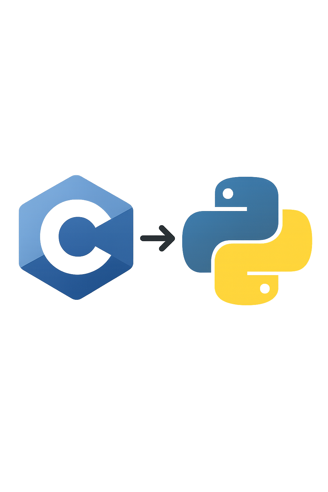

# Compiladores 1 - Grupo 13 - CToPy

<center>

</center>

## O projeto

O projeto foi desenvolvido por alunos do curso de Engenharia de Software, do Grupo 13 da disciplina de Compiladores 1 ofertada na Universidade de Brasília (UnB) - Campus FCTE, e tem como objetivo principal a construção de um compilador simples que converte código C para Python. O projeto é uma aplicação prática dos conceitos aprendidos na disciplina e visa proporcionar uma experiência enriquecedora no desenvolvimento de software.

## Escopo do Projeto
O compilador implementa as seguintes funcionalidades:
- Análise Léxica: Utiliza Flex para identificar tokens no código C, como palavras-chave, identificadores, operadores e literais.
- Análise Sintática: Utiliza Bison para construir uma árvore de sintaxe abstrata (AST) a partir dos tokens identificados, validando a estrutura do código C.
- Análise Semântica: Verifica a semântica do código, garantindo que as operações sejam válidas e que as variáveis sejam declaradas antes de serem usadas.
- Geração de Código Intermediário: Traduz a AST validada para uma representação de código intermediário, como código de três endereços.
- Geração de Código Python: Converte o código intermediário em código Python, permitindo a execução do programa original em um ambiente Python.
- Tabela de Símbolos: Mantém uma tabela de símbolos para gerenciar variáveis e seus tipos, garantindo a consistência semântica do código.
- Tratamento de Erros: Identifica e relata erros léxicos, sintáticos e semânticos, fornecendo mensagens de erro claras para o usuário.
- Testes Automatizados: O projeto inclui uma série de testes para validar o funcionamento do compilador, garantindo que ele produza resultados corretos e consistentes.
- Otimização: O compilador foi projetado para ser eficiente, com foco na performance e na utilização de recursos, garantindo que o código gerado seja executado de forma rápida e eficaz.

## Funcionalidades Implementadas
O compilador já tem implementadas as seguintes funcionalidades principais:

- Análise Léxica: O compilador é capaz de analisar o código C e identificar tokens, como palavras-chave, identificadores, operadores e literais.
- Análise Sintática: O compilador constrói uma árvore de sintaxe abstrata (AST) a partir dos tokens identificados, validando a estrutura do código C.
- Análise Semântica: O compilador verifica a semântica do código, garantindo que as operações sejam válidas e que as variáveis sejam declaradas antes de serem usadas.
- Geração de Código Intermediário: O compilador traduz a AST validada para uma representação de código intermediário, como código de três endereços.
- Tabela de Símbolos: O compilador mantém uma tabela de símbolos para gerenciar variáveis e seus tipos, garantindo a consistência semântica do código.
- Testes: O projeto inclui uma série de testes para validar o funcionamento do compilador, garantindo que ele produza resultados corretos e consistentes.
- Otimização: O compilador foi projetado para ser eficiente, com foco na performance e na utilização de recursos, garantindo que o código gerado seja executado de forma rápida e eficaz.

## Requisitos

Certifique-se de ter as seguintes ferramentas instaladas:

- **Flex**: Para análise léxica.
- **Bison**: Para análise sintática.
- **GCC**: Para compilar o código gerado.


## Como Usar

1. Compile o analisador léxico e sintático:
    ```bash
    flex lexer.l
    bison -d parser.y
    gcc parser.tab.c lex.yy.c ast.c tabela.c -o compiler -lfl
    ```

2. Testar o fluxo léxico-sintático:
    ```bash
    ./compiler < teste.c
    ./compiler < teste2.c
    ./compiler < testeTabela.c
    ./compiler < testeAst.c
    ```


## Contribuidores

<table>
  <tr>
    <td align="center"><a href="https://github.com/ArthurGabrieel"><br /><sub><b>Arthur Gabriel</b></sub></a><br/></td>
    <td align="center"><a href="https://github.com/Caio-bergbjj"><br /><sub><b>Caio Berg</b></sub></a><br/></td>
    <td align="center"><a href="https://github.com/EmivaltoJrr"><br /><sub><b>Emivalto Junior</b></sub></a><br/></td>
    <td align="center"><a href="https://github.com/thiagorfreitas"><br /><sub><b>Thiago Freitas</b></sub></a><br/></td>
    <td align="center"><a href="https://github.com/Wengel-Rodrigues"><br /><sub><b>Wengel Rodrigues</b></sub></a><br/></td>
    <td align="center"><a href="https://github.com/wesleysantos00"><br /><sub><b>Wesley Santos</b></sub></a><br/></td>
  </tr>
</table>

## Metodologia

Neste projeto escolhemos a metodologia ágil Scrum, que nos permitiu organizar o trabalho em sprints, facilitando a colaboração e a entrega incremental de funcionalidades. Utilizamos ferramentas como o GitHub para controle de versão e comunicação entre os membros do grupo.

## Cronograma

Abaixo está o cronograma das sprints do projeto, detalhando as datas de início e término, bem como as principais atividades planejadas para cada sprint:

<center>

| Sprint | Data de Início | Data de Término | Descrição |
| :----: | :------------: | :-------------: | :-------: |
|   1    |   01/03/2025   |    15/03/2025   | Estudo e nivelamento da equipe nas ferramentas utilizadas, definição do escopo do projeto |
|   2    |   16/03/2025   |    30/03/2025   | Implementação inicial do analisador léxico |
|   3    |   01/04/2025   |    15/04/2025   | Implementação inicial do analisador sintático e testes inciais |
|   4    |   16/04/2025   |    30/04/2025   | Implementação da árvore de sintaxe abstrata (AST) e tabela de símbolos |
|   5    |   01/05/2025   |    15/05/2025   | Implementação da análise semântica e geração de código intermediário |
|   6    |   16/05/2025   |    30/05/2025   | Testes finais, correção de bugs e documentação do projeto |

</center>


## Histórico de Versões


<center>

| Versão |    Data    |                      Descrição                      |      Autor(es)      |
| :----: | :--------: | :-------------------------------------------------: | :-----------------: |
|  1.0   | 23/04/2025 | Versão inicial de documento de descrição do projeto | [Thiago Freitas](https://github.com/thiagorfreitas) |
|  2.0  | 30/04/2025 | Atualização do README com informações sobre a metodologia, sprints, e escopo | [Thiago Freitas](https://github.com/thiagorfreitas) |

</center>